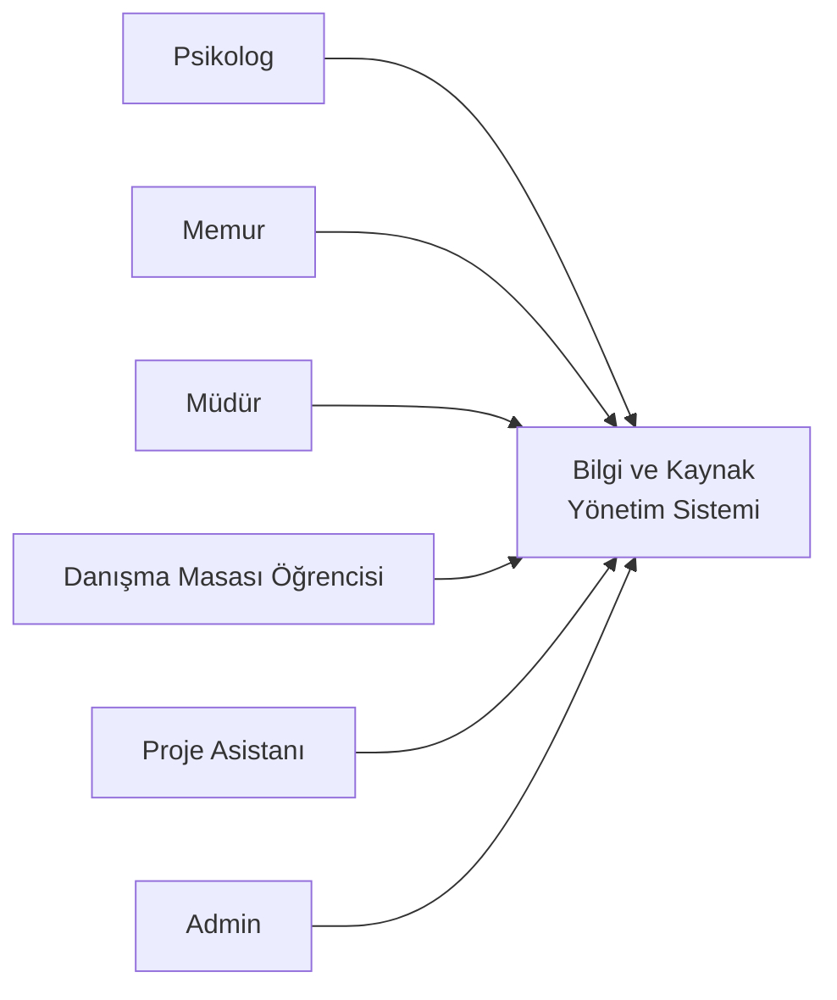
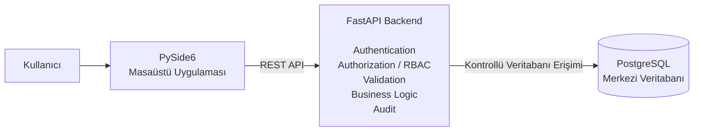

# D05 - Sistem Mimarisi (Architecture)

**Proje:** Travma Uygulama ve Araştırma Merkezi - Bilgi ve Kaynak Yönetim Sistemi  
**Sürüm:** v1.0  
**Doküman:** Sistem Mimarisi

---

## 1. Dokümanın Amacı

Bu doküman, Travma Uygulama ve Araştırma Merkezi için geliştirilen Bilgi ve Kaynak Yönetim Sistemi'nin güncel yazılım mimarisini açıklamak amacıyla hazırlanmıştır.

Sistem; merkez içerisindeki kullanıcı ve yetki yönetimi, randevu ve oda kullanımı, cihaz envanteri ve cihaz rezervasyonları, cihaz bakım/arıza/kalibrasyon süreçleri, danışma masası öğrenci görevleri ve öğrenci faaliyetlerinin tek bir merkezi yapı üzerinden yönetilmesini amaçlamaktadır.

Bu doküman yalnızca hangi teknolojilerin kullanılacağını belirtmez. Aynı zamanda sistem bileşenlerinin birbiriyle nasıl iletişim kuracağını, verilerin hangi katmanda tutulacağını, kullanıcıların hangi işlemleri yapabileceğini ve güvenlik kontrollerinin nerede uygulanacağını da açıklar.

Doküman kapsamında;

- C4 Context Diagram,
- C4 Container Diagram,
- PySide6 istemci, FastAPI backend ve PostgreSQL veritabanının görevleri,
- güncel kullanıcı ve öğrenci yapısı,
- API modülleri,
- rol tabanlı erişim kontrolü (RBAC),
- randevu ve oda yönetimi,
- cihaz envanteri ve cihaz operasyonları,
- öğrenci faaliyet ve puan takibi,
- temel iş kuralları,
- audit ve mimari güvenlik ilkeleri

tanımlanmaktadır.

---

## 2. Sistem Mimarisi - Genel Bakış

Bilgi ve Kaynak Yönetim Sistemi, merkez içerisinde kullanılacak masaüstü tabanlı bir kurum içi yönetim sistemidir. Kullanıcılar doğrudan veritabanı ile işlem yapmayacak; bütün işlemler masaüstü istemci ile backend arasında kurulan REST API iletişimi üzerinden gerçekleştirilecektir.

Sistemin temel mimarisi:

```text
PySide6 Masaüstü Uygulaması
            |
            | REST API
            v
      FastAPI Backend
            |
            | İş Mantığı
            | Kimlik Doğrulama
            | Yetkilendirme / RBAC
            | Veri Doğrulama
            | Audit
            v
       PostgreSQL
```

Bu yapıda üç ana katman vardır:

1. **PySide6 masaüstü uygulaması:** Kullanıcının gördüğü ve işlem yaptığı arayüzdür.
2. **FastAPI backend:** Kullanıcı isteklerini kontrol eden, yetki ve iş kurallarını uygulayan merkezi uygulama katmanıdır.
3. **PostgreSQL:** Sistemin kalıcı verilerinin tutulduğu merkezi ilişkisel veritabanıdır.

Örneğin bir memur cihaz rezervasyonu oluşturmak istediğinde PySide6 arayüzünden gerekli bilgileri girer. İstek FastAPI'ye gönderilir. FastAPI önce kullanıcının oturumunu ve `CIHAZ_REZERVASYON` iznini kontrol eder, ardından cihazın ve girilen zaman aralığının uygunluğunu doğrular. İşlem geçerliyse kayıt PostgreSQL'e yazılır. Böylece güvenlik ve iş kuralları yalnızca arayüzde değil, merkezi olarak backend tarafında uygulanır.

PySide6 istemcisinin PostgreSQL'e doğrudan bağlantısı bulunmayacaktır. Bu karar, veritabanı bilgilerinin istemci tarafına dağıtılmasını engellemek ve bütün veri erişimini tek bir güvenlik katmanından geçirmek için alınmıştır.

Sistem V1.0 kapsamında dış internet erişimine açık olmayacaktır. Kullanım kurumun izin verilen yerel ağ/LAN ortamıyla sınırlandırılacaktır.

---

# 3. C4 Context Diagram

## 3.1. Sistem Bağlamı

Sistem; randevu, takvim, oda, cihaz, kullanıcı, öğrenci ve faaliyet gibi merkez içerisindeki operasyonel kaynakların merkezi olarak yönetilmesini sağlar.

Güncel kullanıcı rolleri:

- Psikolog
- Memur
- Müdür
- Danışma Masası Öğrencisi
- Proje Asistanı
- Admin

Bu roller birbirinden farklı sorumluluklara sahiptir. Kullanıcının sisteme giriş yapabilmesi, sistemdeki her işlemi yapabileceği anlamına gelmez. İşlem yetkileri rol-izin ilişkisine göre ayrıca kontrol edilir.

## 3.2. Kullanıcılar ve Sorumlulukları

### Psikolog

Psikolog, sistemin randevu süreçlerini kullanan temel personel rollerinden biridir.

- Sisteme giriş yapabilir.
- Randevu oluşturabilir.
- Randevu düzenleyebilir.
- Randevu iptal edebilir.
- Randevu takvimini görüntüleyebilir.
- Oda kullanım durumunu görüntüleyebilir.
- Cihaz uygunluğunu görüntüleyebilir.
- Cihaz envanteri, rezervasyon, bakım, kalibrasyon ve arıza yönetimi gerçekleştiremez.
- Kullanıcı, rol ve izin yönetimi gerçekleştiremez.

Psikoloğun cihaz uygunluğunu görüntüleyebilmesi, cihaz üzerinde yönetim yetkisi olduğu anlamına gelmez. Bu rol cihazın uygun olup olmadığını görebilir ancak cihaz envanterini değiştiremez veya cihaz rezervasyonu oluşturamaz.

### Memur

Memur rolü özellikle cihaz ve operasyonel kaynak yönetiminde görev alır.

- Sisteme giriş yapabilir.
- Randevu takvimini ve oda kullanım durumunu görüntüleyebilir.
- Cihaz uygunluğunu görüntüleyebilir.
- Cihaz envanterini yönetebilir.
- Cihaz rezervasyonu yapabilir.
- Cihaz bakım kayıtlarını yönetebilir.
- Kalibrasyon kayıtlarını yönetebilir.
- Arıza kayıtlarını yönetebilir.
- Sisteme yeni cihaz ekleyebilir.
- Cihaz takip kontrol listesini yönetebilir.
- Danışma masası oturumlarını yönetebilir.
- Öğrenci faaliyet kayıtlarını düzenleyebilir.
- Randevu oluşturamaz, düzenleyemez veya iptal edemez.
- Kullanıcı oluşturamaz, rol atayamaz ve audit kayıtlarını inceleyemez.

### Müdür

Müdür rolü hem yönetimsel kullanıcı işlemlerinde hem de cihaz süreçlerinin denetlenmesinde geniş yetkilere sahiptir.

- Sisteme giriş yapabilir.
- Randevu takvimini ve oda kullanım durumunu görüntüleyebilir.
- Cihaz uygunluğunu görüntüleyebilir.
- Cihaz envanterini yönetebilir.
- Bakım, kalibrasyon ve arıza kayıtlarını yönetebilir.
- Sisteme yeni cihaz ekleyebilir.
- Cihaz takip kontrol listesini yönetebilir.
- Kullanıcı oluşturabilir.
- Personel tanımlayabilir.
- Kullanıcı hesaplarını pasifleştirebilir.
- Kullanıcılara rol atayabilir veya mevcut rolü değiştirebilir.
- Audit kayıtlarını inceleyebilir.
- Danışma masası oturumlarını yönetebilir.
- Öğrenci faaliyet kayıtlarını düzenleyebilir.
- Randevu oluşturamaz, düzenleyemez veya iptal edemez.
- Cihaz rezervasyonu yapamaz.

Müdür geniş operasyonel yetkilere sahip olsa da sistemin izin tanımlarını veya rol-izin altyapısını değiştiren süper kullanıcı değildir. Bu işlemler Admin rolüne ayrılmıştır.

### Danışma Masası Öğrencisi

Danışma Masası Öğrencisi, danışma masasında görev yapan öğrenci kullanıcıyı temsil eder.

- Sisteme giriş yapabilir.
- Randevu oluşturabilir.
- Randevu düzenleyebilir.
- Randevu iptal edebilir.
- Randevu takvimini görüntüleyebilir.
- Oda kullanım durumunu görüntüleyebilir.
- Kendi operasyonel görevi kapsamında danışma masası oturumunu yönetebilir.
- Cihaz uygunluğunu görüntüleyemez.
- Cihaz rezervasyonu yapamaz.
- Cihaz, kullanıcı, personel, rol ve audit yönetimi gerçekleştiremez.
- Faaliyet kayıtlarını düzenleme yetkisine sahip değildir.

Danışma masası görevinin gerçek süresi `danisma_masasi_oturumlari` tablosu üzerinden başlangıç ve bitiş zamanı ile takip edilir.

### Proje Asistanı

Proje Asistanı, proje ve cihaz kullanımıyla ilişkili sınırlı operasyonel işlemleri gerçekleştirebilen roldür.

- Sisteme giriş yapabilir.
- Randevu takvimini görüntüleyebilir.
- Oda kullanım durumunu görüntüleyebilir.
- Cihaz uygunluğunu görüntüleyebilir.
- Cihaz rezervasyonu yapabilir.
- Öğrenci faaliyet kayıtlarını düzenleyebilir.
- Randevu oluşturamaz, düzenleyemez veya iptal edemez.
- Cihaz envanteri, bakım, kalibrasyon ve arıza yönetimi gerçekleştiremez.
- Kullanıcı, rol, izin ve audit yönetimi gerçekleştiremez.

### Admin

Admin sistemin süper kullanıcı rolüdür. Müdür rolünden farklı olarak yalnızca operasyonel süreçleri değil, sistemin rol ve izin altyapısını da yönetebilir.

- Sistemde tanımlı bütün izinlere sahiptir.
- Yeni izin tanımlayabilir.
- Mevcut izin tanımını düzenleyebilir.
- Yeni rol oluşturabilir.
- Mevcut rolü düzenleyebilir.
- Roller ile izinler arasındaki ilişkileri yönetebilir.
- Diğer rollerin gerçekleştirebildiği bütün yetkili işlemleri gerçekleştirebilir.

Yeni bir izin sisteme eklendiğinde FastAPI, bu izni ADMIN rolüne otomatik olarak `izin_var = 1` değeriyle bağlamalıdır. Böylece yeni bir izin eklendiğinde Admin'in yetkisiz kalması önlenir.

## 3.3. C4 Context Görünümü



Bu diyagram, sistem sınırının dışındaki kullanıcı rollerini ve bu rollerin merkezi Bilgi ve Kaynak Yönetim Sistemi ile etkileşimini gösterir.

## 3.4. Sistem Sınırı ve Danışan Verisi

Danışan işlemlerinde kalıcı ve benzersiz operasyonel danışan kodları kullanılacaktır.

`danisan_kodlari` tablosunda;

- `danisan_kod_id`,
- `ucretli_mi`,
- `istisna_turu`,
- `aktif_mi`,
- oluşturulma tarihi

gibi sınırlı operasyonel bilgiler tutulur.

Danışanın adı, T.C. kimlik numarası gibi doğrudan kimlik bilgileri ile ayrıntılı klinik, terapi ve psikolojik değerlendirme kayıtları sistem kapsamında tutulmayacaktır.

`istisna_turu` alanı yalnızca belirlenen raporlama gereksinimi için kullanılacaktır.

V1.0 kapsamı dışında:

- mobil uygulama,
- dış internet üzerinden sistem erişimi,
- ayrıntılı klinik kayıt yönetimi,
- terapi kayıtları,
- psikolojik değerlendirme kayıtları,
- gelişmiş BI/raporlama

bulunmaktadır.

---

# 4. C4 Container Diagram

## 4.1. Temel Bileşenler

Sistem üç temel uygulama bileşeninden oluşmaktadır:

1. PySide6 masaüstü istemci uygulaması
2. FastAPI REST API / backend
3. PostgreSQL merkezi veritabanı



Temel veri akışı:

```text
Kullanıcı → PySide6 → REST API → FastAPI → PostgreSQL
```

Veritabanından kullanıcıya dönen cevap ise aynı yolun ters yönünde ilerler:

```text
PostgreSQL → FastAPI → REST API cevabı → PySide6 → Kullanıcı
```

## 4.2. PySide6 Masaüstü Uygulaması

PySide6 sistemin kullanıcı arayüzünü sağlar.

Başlıca görevleri:

- kullanıcıdan veri almak,
- form alanlarını göstermek,
- FastAPI endpointlerine istek göndermek,
- backend'den dönen sonuçları kullanıcıya göstermek,
- kullanıcının yetkisine göre ilgili ekran ve işlemleri sunmak.

Ancak PySide6 güvenliğin ana katmanı değildir. Örneğin bir kullanıcı arayüzde cihaz ekleme butonunu görmüyor olsa bile FastAPI tarafında `CIHAZ_EKLE` izni tekrar kontrol edilmelidir.

## 4.3. FastAPI Backend

FastAPI, sistemin merkezi kontrol ve iş mantığı katmanıdır.

Backend;

- REST API endpointlerini sunar,
- kullanıcı kimliğini doğrular,
- aktif/pasif kullanıcı kontrolü yapar,
- rol ve izin bilgilerini kontrol eder,
- gelen verileri doğrular,
- randevu, oda ve cihaz çakışmaları gibi iş kurallarını uygular,
- PostgreSQL işlemlerini gerçekleştirir,
- kritik işlemler için audit kayıtları oluşturur,
- istemciye kontrollü cevap döndürür.

Örneğin cihaz rezervasyonu isteğinde backend yalnızca `INSERT` sorgusu çalıştırmaz. Kullanıcının rezervasyon yetkisini, cihazın varlığını, cihazın kullanılabilirliğini ve zaman aralığının geçerli olup olmadığını da kontrol eder.

## 4.4. PostgreSQL Veritabanı

PostgreSQL sistemin merkezi ve kalıcı veri katmanıdır.

Veritabanı dört ana iş alanında değerlendirilebilir:

### Kimlik, Kullanıcı ve Yetkilendirme

- `roller`
- `izinler`
- `rol_izinleri`
- `kullanicilar`
- `personel`
- `denetim_kayitlari`

### Öğrenci ve Faaliyet

- `ogrenciler`
- `danisma_masasi_oturumlari`
- `faaliyetler`
- `ogrenci_faaliyet_takip`

### Randevu ve Oda

- `danisan_kodlari`
- `odalar`
- `randevular`
- `oda_etkinlikleri`

### Cihaz ve Kaynak Yönetimi

- `bolumler`
- `cihazlar`
- `cihaz_rezervasyonlari`
- `cihaz_arizalari`
- `cihaz_bakimlari`
- `cihaz_kalibrasyonlari`
- `cihaz_bakim_planlari`
- `cihaz_takip_parametreleri`

Bu yapı sayesinde her operasyon kendi sorumluluğuna uygun tabloda tutulur ve tablolar yabancı anahtarlar üzerinden ilişkilendirilir.

---

# 5. Güncel Veri Modelinin Mimari Açıklaması

## 5.1. Roller, İzinler ve Rol-İzin İlişkisi

`roller` tablosu sistemdeki rol tanımlarını tutar.

`izinler` tablosu sistemde yapılabilecek yetkili işlemleri tanımlar.

`rol_izinleri` tablosu ise hangi rolün hangi izne sahip olduğunu belirler. Bu tabloda `izin_var = 1` izin bulunduğunu, `izin_var = 0` ise izin bulunmadığını ifade eder.

Örnek ilişki:

```text
Kullanıcı
   |
   v
Rol
   |
   v
Rol-İzin
   |
   v
İzin
```

Böylece yetkiler doğrudan uygulama koduna sabitlenmek yerine veritabanı üzerinden yönetilebilir.

## 5.2. Kullanıcı ve Personel

`kullanicilar` tablosu sisteme giriş yapabilen hesapları tutar. Kullanıcı adı, parola hash'i, rol ve hesap aktiflik durumu bu tabloda bulunur.

`personel` tablosu kullanıcı hesabıyla kurum personeli arasındaki operasyonel ilişkiyi kurar.

Parola hiçbir zaman açık metin olarak veritabanında tutulmaz; yalnızca güvenli parola hash'i saklanır.

## 5.3. Öğrenci Yapısı

Gönüllü öğrenciler ve danışma masası öğrencileri ayrı ayrı temel öğrenci tablolarında tutulmak yerine ortak `ogrenciler` tablosunda tutulur.

Öğrenci türü:

```text
GONULLU
DANISMA_MASASI
```

olarak belirlenir.

Bu yaklaşım ortak öğrenci bilgilerini tekrar etmeyi önler.

`ogrenciler.kullanici_id` alanı zorunlu değildir. Bu sayede sistem hesabı bulunmayan gönüllü öğrenci de öğrenci/faaliyet takibinde yer alabilir. Sisteme giriş yapması gereken öğrenci ise kullanıcı hesabıyla ilişkilendirilebilir.

## 5.4. Danışma Masası Oturumları

`danisma_masasi_oturumlari`, danışma masasında görev yapan öğrencinin gerçek çalışma süresini takip eder.

Örnek akış:

```text
Öğrenci "Başlat" seçer
        ↓
baslangic_zamani kaydedilir
        ↓
Görev devam eder
bitis_zamani = NULL
        ↓
Öğrenci "Bitir" işlemini yapar
        ↓
bitis_zamani kaydedilir
onaylandi_mi güncellenir
```

`bitis_zamani`, `baslangic_zamani` değerinden sonra olmak zorundadır.

## 5.5. Faaliyetler ve Öğrenci Faaliyet Takibi

`faaliyetler` tablosu sistemde tanımlı faaliyetleri ve bu faaliyetlerin güncel puanlarını tutar.

Güncel başlangıç değerleri:

| Faaliyet | Puan |
|---|---:|
| Yüz Yüze Anket | 5 |
| Online Anket | 1 |
| İç Tanıtım Görüşmesi | 3 |
| Dış Tanıtım Görüşmesi | 10 |
| Sponsorluk | 20 |
| Sempozyum | 10 |
| PsiLab Etkinliği | 3 |

`ogrenci_faaliyet_takip` tablosu ise bir öğrencinin hangi faaliyeti kaç adet yaptığını, faaliyet tarihini, açıklamasını ve onay durumunu tutar.

`takip_id`, her faaliyet kaydının benzersiz kimliğidir. Aynı öğrenci birden fazla faaliyet yaptığı için `ogrenci_id` tek başına kayıtları birbirinden ayırmaya yeterli değildir.

Örnek:

```text
takip_id = 1 → Öğrenci 5 → Yüz Yüze Anket → 4 adet
takip_id = 2 → Öğrenci 5 → Online Anket     → 10 adet
takip_id = 3 → Öğrenci 5 → Sempozyum        → 1 adet
```

Toplam puan ayrı bir sütunda saklanmaz:

```text
Toplam puan = adet × faaliyetler.puan
```

Bu tasarımda faaliyet puanı daha sonra değiştirilirse hesaplama yeni/güncel puan üzerinden yapılır.

---

# 6. Randevu ve Oda Yönetimi

## 6.1. Danışan Kodları

`danisan_kodlari`, danışanın gerçek kimliği yerine sistem içerisinde kullanılacak operasyonel kodu tutar.

Yeni danışanın ilk randevusunda yeni bir kod oluşturulur. Daha önce kodu bulunan danışanın sonraki randevularında aynı kod kullanılmalıdır.

```text
DN-0048
   ├── Randevu 1
   ├── Randevu 2
   └── Randevu 3
```

Aynı danışan için her randevuda yeni kod oluşturulmaz.

## 6.2. Odalar

`odalar` tablosu merkezde kullanılan fiziksel odaları tutar.

Her oda için;

- oda kimliği,
- oda adı,
- kapasite,
- aktiflik durumu

saklanır.

Oda bilgisi hem randevular hem oda etkinlikleri hem de cihazların zimmetli oda bilgisi tarafından kullanılabilir.

## 6.3. Randevular

`randevular` tablosu;

- danışan kodu,
- psikolog/personel,
- oda,
- başlangıç zamanı,
- bitiş zamanı,
- randevu durumu

arasındaki ilişkiyi tutar.

Temel ilişki:

```text
Danışan Kodu ──┐
               ├──> Randevu
Psikolog ──────┤
Oda ───────────┘
```

Randevu oluşturulurken bitiş zamanının başlangıç zamanından sonra olması ve aynı oda/personel için çakışan kayıt bulunmaması backend iş kuralı olarak kontrol edilmelidir.

## 6.4. Oda Etkinlikleri

`oda_etkinlikleri`, danışan randevusu olmayan ancak oda kullanan faaliyetleri tutar.

Örneğin:

- cihaz kullanım eğitimi,
- seminer,
- haftalık toplantı,
- idari toplantı

bu tablo üzerinden kaydedilebilir.

`katilimci_sayisi`, etkinliğin oda kapasitesine uygunluğunun kontrolünde kullanılabilir.

## 6.5. Randevu ve Cihaz Rezervasyonunun Ayrılması

Randevu ile cihaz rezervasyonu iki farklı süreçtir.

Bir kullanıcının randevu oluşturabilmesi cihaz rezervasyonu yapabileceği anlamına gelmez. Aynı şekilde cihaz rezervasyonu yapabilen bir kullanıcı randevu oluşturma yetkisine otomatik olarak sahip değildir.

Bu ayrım RBAC matrisinde de ayrı izinlerle korunur.

---

# 7. Cihaz Yönetimi

## 7.1. Cihaz Durumları

Cihazın operasyonel durumu `cihaz_durumu` ENUM'u ile sınırlandırılmıştır.

Tanımlı durumlar:

- `Kullanima_Hazir`
- `Rezerve`
- `Kullanimda`
- `Arizali`
- `Bakimda`
- `Kalibrasyonda`
- `Kullanim_Disi`

Bu sayede cihaz durumu serbest metin olarak değil, sistem tarafından bilinen değerlerden biri olarak tutulur.

## 7.2. Bölümler

`bolumler` tablosu cihazın verildiği veya kullanım için ilişkilendirildiği iç/dış bölümü temsil eder.

Bölüm adı, sorumlu kişi, iletişim bilgisi ve aktiflik durumu tutulur.

## 7.3. Cihazlar

`cihazlar` cihaz envanterinin ana tablosudur.

Her cihaz için;

- envanter kodu,
- cihaz adı,
- marka/model,
- seri numarası,
- zimmetli oda,
- cihaz durumu,
- kayıt tarihi

tutulur.

`envanter_kodu` benzersizdir. Seri numarası girildiğinde o da benzersiz olmalıdır.

## 7.4. Cihaz Rezervasyonları

`cihaz_rezervasyonlari`, belirli bir cihazın belirli bir zaman aralığındaki kullanımını kaydeder.

Rezervasyon;

- cihaz,
- bölüm,
- rezervasyonu yapan personel,
- başlangıç zamanı,
- bitiş zamanı,
- iptal durumu,
- kullanılacak oda,
- proje türü,
- proje adı/açıklaması

bilgilerini içerebilir.

Mevcut son şemada proje bilgisi ayrı bir `projeler` tablosunda değil, rezervasyon üzerindeki `proje_turu` ve `proje_adi_aciklamasi` alanlarında tutulmaktadır.

Aynı cihaz için çakışan aktif rezervasyonların oluşturulması backend tarafından engellenmelidir.

## 7.5. Cihaz Arıza Takibi

`cihaz_arizalari`, cihazlarda oluşan arızaların geçmişini tutar.

Bir arıza kaydında;

- cihaz,
- bildiren personel,
- arıza açıklaması,
- bildirim tarihi,
- çözüm tarihi,
- çözülme durumu

bulunur.

Arıza kaydı cihazdan ayrı tabloda tutulduğu için aynı cihazın zaman içinde birden fazla arıza kaydı olabilir.

## 7.6. Cihaz Bakımları

`cihaz_bakimlari`, cihaz üzerinde gerçekleştirilen bakım işlemlerinin geçmişini tutar.

Bakım yapan kişi, yapılan işlem, maliyet ve bakım tarihi kaydedilebilir.

Bir cihazın geçmişteki bütün bakım kayıtları korunabilir.

## 7.7. Cihaz Kalibrasyonları

`cihaz_kalibrasyonlari`, cihaz üzerinde gerçekleştirilen kalibrasyon işlemlerinin geçmişini tutar.

Kalibrasyon yapan kurum, geçerlilik tarihi, sertifika numarası ve işlem tarihi kaydedilir.

Bir cihazın birden fazla kalibrasyon kaydı olabilir; bu nedenle kalibrasyon bilgisi cihaz ana tablosunda tek bir tarih olarak tutulmak yerine ayrı geçmiş tablosunda tutulur.

## 7.8. Cihaz Periyodik Bakım ve Görev Planları

`cihaz_bakim_planlari`, belirli aralıklarla tekrar edilmesi gereken cihaz görevlerini planlamak için kullanılır.

Örneğin:

```text
Görev: Haftalık Şarj
Periyot: 7 gün
Uyarı süresi: 1 gün
Sonraki görev tarihi: 10.10.2026
```

Tablodaki temel alanlar:

- `cihaz_id`
- `gorev_turu`
- `periyot_gun`
- `uyari_suresi_gun`
- `sonraki_gorev_tarihi`
- `aktif_mi`

FastAPI, aktif planları kontrol ederek yaklaşan görevleri tespit edebilir. Mevcut veritabanı şemasında ayrı bir `bildirimler` tablosu tanımlı değildir; bu nedenle kalıcı bildirim kaydı bu D05 sürümünde ayrı bir veritabanı bileşeni olarak varsayılmamaktadır.

## 7.9. Dinamik Cihaz Takip Parametreleri

Her cihazın takip edilmesi gereken özellikleri aynı olmayabilir.

Örneğin:

```text
EEG cihazı → Jel Miktarı → 450 ml
Başka cihaz → Lamba Kullanımı → 1200 Saat
```

Bu nedenle her yeni özellik için `cihazlar` tablosuna yeni bir sütun eklemek yerine `cihaz_takip_parametreleri` kullanılır.

Bu tablo;

- cihazı,
- parametre adını,
- parametre değerini,
- birimini,
- son güncelleme zamanını

tutar.

Böylece cihazdan cihaza değişebilen takip değerleri daha esnek biçimde yönetilebilir.

---

# 8. API Yapısı

API modülleri veritabanındaki ana iş alanlarıyla uyumlu olacak şekilde ayrılır.

| API Alanı | Sorumluluk |
|---|---|
| `auth` | Giriş, kimlik doğrulama ve oturum/token işlemleri |
| `users` | Kullanıcı hesaplarının yönetimi |
| `roles` | Rol tanımları |
| `permissions` | İzin tanımları |
| `role-permissions` | Rol-izin ilişkilerinin yönetimi |
| `staff` | Personel işlemleri |
| `students` | Gönüllü ve danışma masası öğrencileri |
| `consultation-sessions` | Danışma masası başlangıç/bitiş oturumları |
| `activities` | Faaliyet ve güncel puan tanımları |
| `student-activities` | Öğrencilerin faaliyet kayıtları |
| `client-codes` | Danışan kodu işlemleri |
| `appointments` | Randevu işlemleri |
| `rooms` | Oda yönetimi |
| `room-events` | Eğitim/seminer/toplantı gibi oda etkinlikleri |
| `departments` | Bölüm işlemleri |
| `devices` | Cihaz envanteri ve cihaz durumları |
| `device-reservations` | Cihaz rezervasyonları |
| `device-failures` | Cihaz arıza kayıtları |
| `device-maintenance` | Cihaz bakım kayıtları |
| `device-calibrations` | Cihaz kalibrasyon kayıtları |
| `device-maintenance-plans` | Periyodik cihaz bakım/görev planları |
| `device-tracking-parameters` | Cihaza özel takip parametreleri |
| `audit` | Denetim kayıtlarının görüntülenmesi/kaydedilmesi |

Kesin endpoint yolları geliştirme aşamasında belirlenebilir.

## 8.1. API Tasarım İlkeleri

- İstemci PostgreSQL'e doğrudan erişmeyecektir.
- Korunan endpointlerde kimlik doğrulama uygulanacaktır.
- Kullanıcı aktiflik durumu kontrol edilecektir.
- İşlemler rol ve izin kontrollerine tabi olacaktır.
- İstemcinin gönderdiği rol/yetki bilgilerine güvenilmeyecektir.
- Gelen veriler sunucu tarafında doğrulanacaktır.
- ORM veya parametrik sorgular kullanılacaktır.
- İş kurallarına uymayan istekler kontrollü şekilde reddedilecektir.
- Hata cevaplarında gereksiz teknik ayrıntılar gösterilmeyecektir.
- Kritik işlemler audit kayıtlarına aktarılacaktır.

---

# 9. Rol Tabanlı Erişim Kontrolü (RBAC)

## 9.1. RBAC Yapısı

RBAC yapısının amacı, kullanıcının yalnızca görevi için gerekli işlemleri gerçekleştirmesidir.

Roller:

- `PSIKOLOG`
- `MEMUR`
- `MUDUR`
- `DANISMA_OGRENCISI`
- `PROJE_ASISTANI`
- `ADMIN`

İzinler `izinler` tablosunda, rolün izne sahip olup olmadığı ise `rol_izinleri` tablosunda tutulur.

## 9.2. Güncel RBAC Matrisi

`Evet` izin bulunduğunu, `Hayır` izin bulunmadığını gösterir.

| İşlem | Psikolog | Memur | Müdür | Danışma Öğrencisi | Proje Asistanı | Admin |
|---|:---:|:---:|:---:|:---:|:---:|:---:|
| Randevu oluşturma | Evet | Hayır | Hayır | Evet | Hayır | Evet |
| Randevu düzenleme | Evet | Hayır | Hayır | Evet | Hayır | Evet |
| Randevu iptal etme | Evet | Hayır | Hayır | Evet | Hayır | Evet |
| Randevu takvimini görüntüleme | Evet | Evet | Evet | Evet | Evet | Evet |
| Oda kullanım durumunu görüntüleme | Evet | Evet | Evet | Evet | Evet | Evet |
| Cihaz uygunluğunu görüntüleme | Evet | Evet | Evet | Hayır | Evet | Evet |
| Cihaz envanterini yönetme | Hayır | Evet | Evet | Hayır | Hayır | Evet |
| Cihaz rezervasyonu yapma | Hayır | Evet | Hayır | Hayır | Evet | Evet |
| Bakım kayıtlarını yönetme | Hayır | Evet | Evet | Hayır | Hayır | Evet |
| Kalibrasyon kayıtlarını yönetme | Hayır | Evet | Evet | Hayır | Hayır | Evet |
| Arıza kayıtlarını yönetme | Hayır | Evet | Evet | Hayır | Hayır | Evet |
| Kullanıcı oluşturma | Hayır | Hayır | Evet | Hayır | Hayır | Evet |
| Personel tanımlama | Hayır | Hayır | Evet | Hayır | Hayır | Evet |
| Kullanıcı pasifleştirme | Hayır | Hayır | Evet | Hayır | Hayır | Evet |
| Rol atama/değiştirme | Hayır | Hayır | Evet | Hayır | Hayır | Evet |
| Audit kayıtlarını inceleme | Hayır | Hayır | Evet | Hayır | Hayır | Evet |
| Danışma masası oturumunu yönetme | Hayır | Evet | Evet | Evet | Hayır | Evet |
| Cihaz ekleme | Hayır | Evet | Evet | Hayır | Hayır | Evet |
| Faaliyet kayıtlarını düzenleme | Hayır | Evet | Evet | Hayır | Evet | Evet |
| Cihaz takip kontrol listesini yönetme | Hayır | Evet | Evet | Hayır | Hayır | Evet |
| Yeni izin tanımlama | Hayır | Hayır | Hayır | Hayır | Hayır | Evet |
| İzin düzenleme | Hayır | Hayır | Hayır | Hayır | Hayır | Evet |
| Rol-izin yönetme | Hayır | Hayır | Hayır | Hayır | Hayır | Evet |
| Rol oluşturma | Hayır | Hayır | Hayır | Hayır | Hayır | Evet |
| Rol düzenleme | Hayır | Hayır | Hayır | Hayır | Hayır | Evet |

Sisteme giriş, `rol_izinleri` tablosunda ayrı bir işlem izni olarak tutulmaz. Giriş; doğru kimlik doğrulama bilgileri ve `kullanicilar.aktif_mi` alanı üzerinden kontrol edilir.

## 9.3. Yetkilendirme Prensibi

Yetkilendirme FastAPI backend katmanında gerçekleştirilir.

Kontrol zinciri:

```text
İstek
  ↓
Kullanıcı doğrulandı mı?
  ↓
Kullanıcı aktif mi?
  ↓
Kullanıcının rolü nedir?
  ↓
Rol gerekli izne sahip mi?
  ↓
İş kuralı uygun mu?
  ↓
İşlem gerçekleştirilir
```

Arayüzde bir butonun gizlenmesi tek başına güvenlik kontrolü değildir. Kullanıcı API'ye doğrudan istek göndermeye çalışsa bile backend gerekli izni kontrol etmelidir.

## 9.4. Admin Yetkilendirme Kuralı

Admin'in sistemde tanımlı tüm izinlere sahip olması gerekir.

Yeni izin oluşturma işlemi sırasında backend;

1. yeni izni `izinler` tablosuna ekler,
2. ADMIN rolünü bulur,
3. yeni izin ile ADMIN arasında `rol_izinleri` kaydı oluşturur,
4. `izin_var = 1` olarak ayarlar.

Ayrıca sistemde son aktif Admin hesabının yanlışlıkla pasifleştirilmesini önleyen bir iş kuralı uygulanması önerilir.

---

# 10. Temel İş Kuralları

## 10.1. Danışan Kodu İş Kuralı

Danışan kodu, danışanı sistem içerisinde temsil eden benzersiz ve kalıcı operasyonel tanımlayıcıdır.

Yeni bir danışanın ilk randevusunda yeni kod oluşturulur. Daha önce kodu bulunan danışanın sonraki randevularında mevcut kod kullanılır.

Danışan kodunu ad, T.C. kimlik numarası veya benzeri gerçek kimlik bilgileriyle eşleştiren ayrı bir kayıt sistem içerisinde tutulmayacaktır.

## 10.2. İstisna Türü

`istisna_turu` alanı raporlama amacıyla tutulur.

Mevcut örnek değerler:

- `YOK`
- `KANSER_HASTASI`
- `SEHIT_GAZI_YAKINI`

## 10.3. Zaman Aralığı Kontrolleri

Randevu, cihaz rezervasyonu ve oda etkinliği gibi başlangıç/bitiş zamanı bulunan işlemlerde bitiş zamanı başlangıç zamanından sonra olmalıdır.

Ayrıca aynı kaynak için çakışan aktif kayıtların engellenmesi backend iş kuralıdır.

## 10.4. Cihaz Rezervasyonu

Cihaz rezervasyonu randevudan bağımsızdır. Rezervasyon sırasında cihazın uygunluğu, zaman aralığı ve kullanıcının yetkisi kontrol edilir.

## 10.5. Cihaz Durumu

Cihazın durumu yalnızca tanımlı `cihaz_durumu` değerlerinden biri olabilir. Arıza, bakım veya kalibrasyon gibi operasyonlar gerektiğinde cihaz durumunu uygun değere geçirebilir. Bu geçişler backend tarafından kontrollü yapılmalıdır.

## 10.6. Periyodik Cihaz Görevleri

Aktif bakım/görev planları `sonraki_gorev_tarihi` ve `uyari_suresi_gun` alanlarına göre değerlendirilir.

Görev tamamlandıktan sonra sonraki görev tarihi tanımlı `periyot_gun` bilgisine göre güncellenebilir.

## 10.7. Öğrenci Faaliyet Puanı

Faaliyet puanının tek kaynağı `faaliyetler.puan` alanıdır.

`ogrenci_faaliyet_takip` tablosunda ayrı bir toplam puan veya geçmiş puan kopyası tutulmaz.

Örnek:

```text
Yüz Yüze Anket puanı = 5
Öğrencinin yaptığı adet = 4

Toplam = 4 × 5 = 20
```

Puan daha sonra 6 yapılırsa hesaplama güncel değere göre:

```text
4 × 6 = 24
```

olur.

---

# 11. Mimari Güvenlik İlkeleri

## 11.1. Kimlik Doğrulama

- Parolalar açık metin saklanmayacaktır.
- Güvenli parola hashleme yöntemi kullanılacaktır.
- Pasif kullanıcıların sisteme girişi engellenecektir.
- Eksik, geçersiz veya süresi dolmuş kimlik doğrulama bilgileri reddedilecektir.

Kimlik doğrulama, kullanıcının kim olduğunu belirler. Yetkilendirme ise doğrulanmış kullanıcının hangi işlemleri yapabileceğini belirler. Bu iki kontrol birbirinden ayrıdır.

## 11.2. Yetkilendirme

Kimliği doğrulanmış kullanıcı yalnızca rolüne verilmiş izinleri kullanabilir.

FastAPI, korunan her endpointte gerekli izni sunucu tarafında kontrol edecektir.

## 11.3. Sunucu Tarafı Veri Doğrulama

İstemciden gelen veriler güvenilir kabul edilmeyecektir.

Örneğin;

- negatif faaliyet adedi,
- başlangıçtan önce biten rezervasyon,
- var olmayan cihaz kimliği,
- geçersiz rol veya izin bilgisi

backend tarafından reddedilmelidir.

## 11.4. Güvenli Veritabanı Erişimi

PySide6 istemcisine doğrudan PostgreSQL erişimi verilmeyecektir.

Veritabanı işlemlerinde ORM veya parametrik sorgular kullanılacaktır. Böylece kullanıcı girdilerinin doğrudan SQL komutuna dönüştürülmesi engellenecektir.

## 11.5. Güvenli Hata Yönetimi

Kullanıcıya gösterilen hata mesajları kontrollü olmalıdır.

SQL sorguları, dosya yolları, stack trace, veritabanı parolaları veya uygulama içi gizli yapılandırma değerleri kullanıcıya gösterilmemelidir.

## 11.6. Gizli Bilgilerin Yönetimi

Veritabanı parolaları, uygulama anahtarları ve diğer secret değerler kaynak kod içerisine yazılmamalı ve Git deposuna gönderilmemelidir.

## 11.7. Denetim Kayıtları (Audit)

Sistemde kritik işlemler audit kayıtlarıyla izlenecektir.

Tanımlı temel olay türleri:

- `LOGIN`
- `LOGIN_FAILED`
- `CREATE`
- `UPDATE`
- `CANCEL`
- `ROLE_CHANGE`
- `DEVICE_STATUS_CHANGE`

Örneğin randevu oluşturma `CREATE`, randevu düzenleme `UPDATE`, randevu iptali `CANCEL` olarak kaydedilebilir.

`LOGIN_FAILED` olayında geçerli bir kullanıcı bulunmayabileceği için audit kaydındaki `kullanici_id` alanı NULL olabilir.

Normal kullanıcıların audit kayıtlarını değiştirmesine veya silmesine izin verilmemelidir.

## 11.8. Tekrarlanan Giriş Denemelerine Karşı Koruma

Başarısız girişlerin sınırsız şekilde denenmesine izin verilmemelidir.

Rate-control veya belirli sayıda başarısız girişten sonra geçici hesap kilitleme uygulanabilir. Kesin mekanizma geliştirme aşamasında belirlenebilir.

## 11.9. Yedek Güvenliği

Veritabanı yedekleri de üretim verisi kadar korunmalıdır. Yedek dosyalarına yalnızca yetkili kullanıcıların veya yetkili sistem süreçlerinin erişmesine izin verilmelidir.

---

# 12. Mimari Kararlar ve Sınırlar

- PySide6 masaüstü istemci kullanılacaktır.
- FastAPI backend kullanılacaktır.
- Merkezi veritabanı PostgreSQL olacaktır.
- İstemciler PostgreSQL'e doğrudan bağlanmayacaktır.
- İletişim REST API üzerinden gerçekleştirilecektir.
- Kimlik doğrulama ve yetkilendirme backend tarafında uygulanacaktır.
- Sistem rol ve izin tabanlı RBAC kullanacaktır.
- Güncel roller `PSIKOLOG`, `MEMUR`, `MUDUR`, `DANISMA_OGRENCISI`, `PROJE_ASISTANI` ve `ADMIN` olacaktır.
- ADMIN sistemin süper kullanıcı rolüdür ve bütün izinlere sahiptir.
- Yeni izinler ADMIN rolüne otomatik olarak bağlanacaktır.
- Gönüllü ve danışma masası öğrencileri ortak `ogrenciler` tablosunda tutulacaktır.
- Öğrenci türü `GONULLU` veya `DANISMA_MASASI` olacaktır.
- Danışma masası görev zamanları `danisma_masasi_oturumlari` tablosunda tutulacaktır.
- Öğrenci faaliyetleri `ogrenci_faaliyet_takip` tablosunda tutulacaktır.
- Faaliyet puanları `faaliyetler` tablosundaki güncel değer üzerinden hesaplanacaktır.
- Danışan kodu kalıcı ve benzersiz operasyonel kod olacaktır.
- Danışan kodu ile gerçek kimlik bilgileri arasında sistem içinde eşleştirme tutulmayacaktır.
- Randevu ve cihaz rezervasyonu bağımsız süreçlerdir.
- Oda etkinlikleri randevulardan ayrı olarak tutulacaktır.
- Cihaz arıza, bakım ve kalibrasyon geçmişleri ayrı tablolarda tutulacaktır.
- Periyodik cihaz görevleri `cihaz_bakim_planlari` tablosuyla takip edilecektir.
- Cihaza göre değişebilen takip özellikleri `cihaz_takip_parametreleri` tablosunda tutulacaktır.
- Mevcut son şemada proje bilgisi cihaz rezervasyonundaki `proje_turu` ve `proje_adi_aciklamasi` alanlarıyla tutulmaktadır.
- Mevcut son şemada ayrı bir kalıcı `bildirimler` tablosu bulunmamaktadır.
- Sistem V1.0 kapsamında dış internet erişimine açık olmayacaktır.

---

# 13. Sonuç

Bu mimariyle kullanıcı arayüzü, iş mantığı ve veri katmanı birbirinden ayrılmıştır. PySide6 yalnızca kullanıcı etkileşimini yürütür; FastAPI kimlik doğrulama, yetkilendirme, doğrulama ve iş kurallarının merkezi uygulama noktasıdır; PostgreSQL ise kalıcı ve ilişkisel veriyi tutar.

Güncel yapı yalnızca randevu yönetimini değil; cihaz envanteri ve rezervasyonlarını, cihaz bakım/arıza/kalibrasyon geçmişini, periyodik cihaz görevlerini, öğrenci faaliyetlerini, danışma masası çalışma sürelerini ve dinamik rol-izin yönetimini de kapsar.

Bu ayrım sayesinde yeni işlevler eklenirken güvenlik kontrollerinin tek bir backend katmanında uygulanması, verilerin merkezi biçimde tutulması ve farklı kullanıcı rollerinin yalnızca kendilerine tanımlanan işlemleri gerçekleştirmesi hedeflenmektedir.
