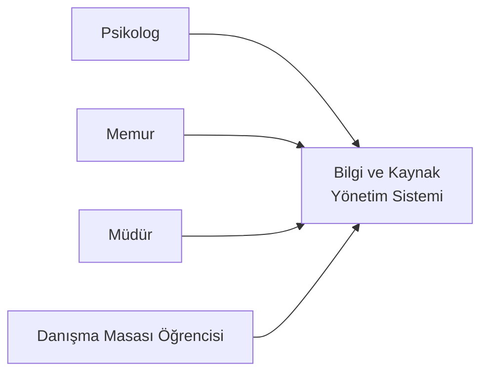
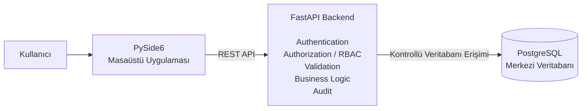

# D05 - Sistem Mimarisi (Architecture)

**Proje:** Travma Uygulama ve Araştırma Merkezi - Bilgi ve Kaynak Yönetim Sistemi  
**Sürüm:** v1.0  
**Doküman:** Sistem Mimarisi

---

## 1. Dokümanın Amacı

Bu doküman, Bilgi ve Kaynak Yönetim Sistemi'nin temel yazılım mimarisini tanımlamak amacıyla hazırlanmıştır.

Doküman kapsamında;

- C4 Context Diagram,
- C4 Container Diagram,
- temel sistem bileşenleri,
- API yapısı,
- rol tabanlı erişim kontrolü (RBAC),
- temel iş kuralları,
- mimari güvenlik ilkeleri

tanımlanmaktadır.

---

## 2. Sistem Mimarisi - Genel Bakış

Bilgi ve Kaynak Yönetim Sistemi, Travma Uygulama ve Araştırma Merkezi içerisindeki operasyonel süreçlerin yönetilmesi amacıyla tasarlanmış masaüstü tabanlı bir sistemdir.

Sistemin temel mimarisi:

```text
PySide6 Masaüstü Uygulaması
            |
            | REST API
            v
      FastAPI Backend
            |
            | İş Mantığı
            | Kimlik Doğrulama
            | Yetkilendirme
            | Veri Doğrulama
            | Audit
            v
       PostgreSQL
```

Kullanıcılar sisteme PySide6 tabanlı masaüstü uygulaması üzerinden erişecektir. Masaüstü istemci PostgreSQL veritabanına doğrudan bağlanmayacak; tüm veri okuma ve değiştirme işlemleri FastAPI backend üzerinden gerçekleştirilecektir.

Sistem V1.0 kapsamında dış internet erişimine açık olmayacaktır.

---

# 3. C4 Context Diagram

## 3.1. Sistem Bağlamı

Sistem; merkez içerisindeki randevu, takvim, oda, cihaz, kullanıcı ve diğer operasyonel kaynakların merkezi olarak yönetilmesini sağlar.

Kullanıcı rolleri:

- Psikolog
- Memur
- Müdür
- Danışma Masası Öğrencisi

Danışma Masası Öğrencisi rolü, başlangıçtaki proje kapsamından sonra belirlenen operasyonel ihtiyaç doğrultusunda sisteme eklenmiştir.

## 3.2. Kullanıcılar

### Psikolog
- Sisteme giriş yapabilir.
- Randevuları görüntüleyebilir, oluşturabilir, düzenleyebilir ve iptal edebilir.
- Randevu takvimini ve oda kullanım durumunu görüntüleyebilir.
- Cihaz uygunluğunu görüntüleyebilir.
- Cihaz rezervasyonu, cihaz envanteri, bakım, kalibrasyon ve arıza yönetimi gerçekleştiremez.

### Memur
- Sisteme giriş yapabilir.
- Randevuları, randevu takvimini ve oda kullanım durumunu görüntüleyebilir.
- Cihaz uygunluğunu görüntüleyebilir.
- Cihaz envanterini yönetebilir ve cihaz rezervasyonu yapabilir.
- Bakım, kalibrasyon ve arıza kayıtlarını yönetebilir.
- Randevu oluşturamaz, düzenleyemez veya iptal edemez.

### Müdür
- Sisteme giriş yapabilir.
- Randevuları, randevu takvimini ve oda kullanım durumunu görüntüleyebilir.
- Cihaz uygunluğunu görüntüleyebilir.
- Cihaz envanterini, bakım ve kalibrasyon kayıtlarını yönetebilir.
- Kullanıcı oluşturabilir, personel tanımlayabilir ve kullanıcı hesaplarını pasifleştirebilir.
- Rol atama/değiştirme işlemlerini gerçekleştirebilir.
- Denetim kayıtlarını, dashboard ve temel raporları inceleyebilir.
- Randevu oluşturamaz, düzenleyemez veya iptal edemez.
- Cihaz rezervasyonu yapamaz ve arıza kayıtlarını yönetemez.

### Danışma Masası Öğrencisi
- Sisteme giriş yapabilir.
- Randevuları görüntüleyebilir, oluşturabilir, düzenleyebilir ve iptal edebilir.
- Randevu takvimini ve oda kullanım durumunu görüntüleyebilir.
- Cihaz, kullanıcı, rol ve denetim kaydı yönetimi yetkisi yoktur.

## 3.3. C4 Context Görünümü



Bu diyagram sistemi hangi kullanıcı rollerinin kullandığını gösterir.

## 3.4. Sistem Sınırı

Danışan işlemlerinde kalıcı ve benzersiz operasyonel danışan kodları kullanılacaktır.

Danışanın adı, T.C. kimlik numarası gibi doğrudan kimlik bilgileri ile ayrıntılı klinik, terapi ve psikolojik değerlendirme kayıtları sistem kapsamında tutulmayacaktır.

Raporlama gereksinimi kapsamında danışan koduyla ilişkili sınırlı istisna kategorisi bilgisi tutulacaktır.

V1.0 kapsamı dışında:

- mobil uygulama,
- SMS/e-posta bildirimleri,
- yapay zekâ özellikleri,
- ayrıntılı klinik kayıt yönetimi,
- terapi kayıtları,
- psikolojik değerlendirme kayıtları,
- gelişmiş BI/raporlama,
- dış internet üzerinden sistem erişimi.

---

# 4. C4 Container Diagram

Sistem üç temel uygulama bileşeninden oluşmaktadır:

1. PySide6 masaüstü istemci uygulaması
2. FastAPI REST API / backend
3. PostgreSQL merkezi veritabanı



Temel veri akışı:

```text
Kullanıcı → PySide6 → REST API → FastAPI → PostgreSQL
```

PySide6 istemcisinin PostgreSQL veritabanına doğrudan bağlantısı bulunmayacaktır.

## 4.1. PySide6 Masaüstü Uygulaması

PySide6 kullanıcı arayüzünü sağlar. Kullanıcıdan verileri alır, REST API üzerinden backend'e istek gönderir ve backend sonuçlarını kullanıcıya gösterir. Yetkilendirme yalnızca kullanıcı arayüzüne bırakılmaz.

## 4.2. FastAPI Backend

Backend;

- REST API endpointlerini sunar,
- kullanıcı kimliğini doğrular,
- rol ve yetki kontrollerini gerçekleştirir,
- sunucu tarafı veri doğrulaması yapar,
- iş kurallarını uygular,
- veritabanı işlemlerini gerçekleştirir,
- gerekli denetim kayıtlarını oluşturur.

## 4.3. PostgreSQL Veritabanı

Veritabanında kullanıcılar, roller, personel, danışma masası öğrencileri, danışan kodları, randevular, odalar, oda etkinlikleri, bölümler, cihazlar, cihaz rezervasyonları, cihaz arızaları, cihaz bakımları, cihaz kalibrasyonları ve denetim kayıtları tutulacaktır.

---

# 5. API Yapısı

| API Alanı | Sorumluluk |
|---|---|
| `auth` | Giriş ve kimlik doğrulama |
| `users` | Kullanıcı yönetimi |
| `roles` | Rol yönetimi |
| `staff` | Personel işlemleri |
| `consultation-students` | Danışma masası öğrencisi işlemleri |
| `client-codes` | Danışan kodları |
| `appointments` | Randevu işlemleri |
| `rooms` | Oda işlemleri |
| `room-events` | Oda etkinlikleri |
| `departments` | Bölüm işlemleri |
| `devices` | Cihaz envanteri |
| `device-reservations` | Cihaz rezervasyonları |
| `device-failures` | Cihaz arızaları |
| `device-maintenance` | Cihaz bakımları |
| `device-calibrations` | Cihaz kalibrasyonları |
| `audit` | Denetim kayıtları |

Kesin endpoint yolları geliştirme aşamasında belirlenebilir.

## 5.1. API Tasarım İlkeleri

- İstemci PostgreSQL'e doğrudan erişmeyecektir.
- Korunan endpointlerde kimlik doğrulama uygulanacaktır.
- İşlemler rol ve yetki kontrollerine tabi olacaktır.
- Gelen veriler sunucu tarafında doğrulanacaktır.
- İstemcinin gönderdiği rol/yetki bilgilerine doğrudan güvenilmeyecektir.
- ORM veya parametrik sorgular kullanılacaktır.
- Hata cevaplarında gereksiz teknik ayrıntılar gösterilmeyecektir.
- Gerekli kritik işlemler denetim kayıtlarına aktarılacaktır.

---

# 6. Temel İş Kuralları

## 6.1. Danışan Kodu İş Kuralı

Danışan kodu, danışanı sistem içerisinde temsil eden benzersiz ve kalıcı operasyonel bir tanımlayıcıdır.

Yeni bir danışanın ilk randevusu oluşturulurken yeni bir danışan kodu oluşturulur. Daha önce kod oluşturulmuş bir danışanın sonraki randevularında mevcut kod kullanılır. Aynı danışan için her randevuda yeni kod oluşturulmaz.

```text
DN-0048
   ├── Randevu 1
   ├── Randevu 2
   └── Randevu 3
```

Mevcut danışan kodu, randevu oluşturma yetkisine sahip kullanıcı tarafından randevu oluşturma sırasında kullanılır.

Sistem içerisinde danışan kodunu ad, T.C. kimlik numarası veya benzeri gerçek kimlik bilgileriyle eşleştiren ayrı bir kayıt tutulmayacaktır.

## 6.2. İstisna Türü İş Kuralı

`istisna_turu` alanı raporlama amacıyla tutulacaktır.

Kullanılacak değerler:

- `YOK`
- `KANSER_HASTASI`
- `SEHIT_GAZI_YAKINI`

`YOK`, herhangi bir istisna bulunmadığını ifade eder.

## 6.3. Randevu ve Cihaz Rezervasyonu

Randevu oluşturma ve cihaz rezervasyonu bağımsız operasyonel süreçlerdir. Birine sahip olunan yetki diğerini otomatik olarak sağlamaz.

---

# 7. Rol Tabanlı Erişim Kontrolü (RBAC)

Roller:

- `PSIKOLOG`
- `MEMUR`
- `MUDUR`
- `DANISMA_OGRENCISI`

## 7.1. RBAC Matrisi

| İşlem | Psikolog | Memur | Müdür | Danışma Öğrencisi |
|---|:---:|:---:|:---:|:---:|
| Sisteme giriş | Evet | Evet | Evet | Evet |
| Randevuları görüntüleme | Evet | Evet | Evet | Evet |
| Randevu oluşturma | Evet | Hayır | Hayır | Evet |
| Randevu düzenleme | Evet | Hayır | Hayır | Evet |
| Randevu iptal etme | Evet | Hayır | Hayır | Evet |
| Randevu takvimini görüntüleme | Evet | Evet | Evet | Evet |
| Oda kullanım durumunu görüntüleme | Evet | Evet | Evet | Evet |
| Cihaz uygunluğunu görüntüleme | Evet | Evet | Evet | Hayır |
| Cihaz envanterini yönetme | Hayır | Evet | Evet | Hayır |
| Cihaz rezervasyonu yapma | Hayır | Evet | Hayır | Hayır |
| Bakım kayıtlarını yönetme | Hayır | Evet | Evet | Hayır |
| Kalibrasyon kayıtlarını yönetme | Hayır | Evet | Evet | Hayır |
| Arıza kayıtlarını yönetme | Hayır | Evet | Hayır | Hayır |
| Kullanıcı oluşturma | Hayır | Hayır | Evet | Hayır |
| Personel tanımlama | Hayır | Hayır | Evet | Hayır |
| Kullanıcı pasifleştirme | Hayır | Hayır | Evet | Hayır |
| Rol atama/değiştirme | Hayır | Hayır | Evet | Hayır |
| Denetim kayıtlarını inceleme | Hayır | Hayır | Evet | Hayır |

## 7.2. Yetkilendirme Prensibi

Yetkilendirme FastAPI backend katmanında gerçekleştirilecektir. Arayüzde bir butonun gizlenmesi tek başına güvenlik kontrolü değildir.

## 7.3. Alan Bazlı Yetkilendirme

Kullanıcı rolü, hesap aktiflik durumu ve yetki bilgileri gibi kritik alanlar yalnızca gerekli yetkiye sahip kullanıcılar tarafından değiştirilebilecektir. Gerekli işlemlerde kayıt/nesne seviyesinde erişim kontrolleri uygulanacaktır.

---

# 8. Mimari Güvenlik İlkeleri

## 8.1. Kimlik Doğrulama
- Parolalar açık metin saklanmayacaktır.
- Güvenli parola hashleme kullanılacaktır.
- Pasif kullanıcıların girişi engellenecektir.
- Eksik, geçersiz veya süresi dolmuş kimlik doğrulama bilgileri reddedilecektir.

## 8.2. Yetkilendirme
Kimliği doğrulanmış kullanıcılar yalnızca rollerine tanımlanan işlemleri gerçekleştirebilecektir.

## 8.3. Sunucu Tarafı Veri Doğrulama
İstemci girdileri backend tarafında doğrulanacak; geçersiz ve iş kurallarına uymayan veriler kontrollü şekilde reddedilecektir.

## 8.4. Güvenli Veritabanı Erişimi
PostgreSQL'e doğrudan istemci erişimine izin verilmeyecek; ORM veya parametrik sorgular kullanılacaktır.

## 8.5. Güvenli Hata Yönetimi
SQL sorguları, dosya yolları, uygulama iç detayları, parola veya gizli yapılandırma değerleri hata mesajlarında açığa çıkarılmayacaktır.

## 8.6. Gizli Bilgilerin Yönetimi
Veritabanı parolaları, uygulama anahtarları ve benzeri gizli bilgiler kaynak kodda veya Git deposunda tutulmayacaktır.

## 8.7. Denetim Kayıtları

Temel olaylar:

- `LOGIN`
- `LOGIN_FAILED`
- `CREATE`
- `UPDATE`
- `CANCEL`
- `ROLE_CHANGE`
- `DEVICE_STATUS_CHANGE`

Randevu oluşturma `CREATE`, düzenleme `UPDATE`, iptal `CANCEL` olarak ele alınacaktır. Normal kullanıcıların denetim kayıtlarını değiştirmesine veya silmesine izin verilmeyecektir.

## 8.8. Tekrarlanan Giriş Denemelerine Karşı Koruma
Rate-control veya geçici hesap kilitleme mekanizmalarından biri kullanılacaktır. Kesin yöntem geliştirme aşamasında belirlenecektir.

## 8.9. Yedek Güvenliği
Veritabanı yedeklerine erişim yetkili kullanıcılar veya yetkili sistem süreçleriyle sınırlandırılacaktır.

---

# 9. Mimari Kararlar ve Sınırlar

- PySide6 masaüstü istemci kullanılacaktır.
- FastAPI backend kullanılacaktır.
- Merkezi veritabanı PostgreSQL olacaktır.
- İstemciler PostgreSQL'e doğrudan bağlanmayacaktır.
- İletişim REST API üzerinden gerçekleştirilecektir.
- Kimlik doğrulama ve yetkilendirme backend tarafında uygulanacaktır.
- Sistem RBAC kullanacaktır.
- Danışan kodu kalıcı ve benzersiz operasyonel kod olacaktır.
- Aynı danışanın sonraki randevularında mevcut kod kullanılacaktır.
- Danışan kodu ile gerçek kimlik bilgileri arasında sistem içinde eşleştirme tutulmayacaktır.
- `istisna_turu` değerleri `YOK`, `KANSER_HASTASI`, `SEHIT_GAZI_YAKINI` olacaktır.
- Randevu ve cihaz rezervasyonu bağımsız süreçlerdir.
- Danışma Masası Öğrencisi sonradan belirlenen operasyonel ihtiyaç doğrultusunda eklenen roldür.
- V1.0 dış internet erişimine açık olmayacaktır.
