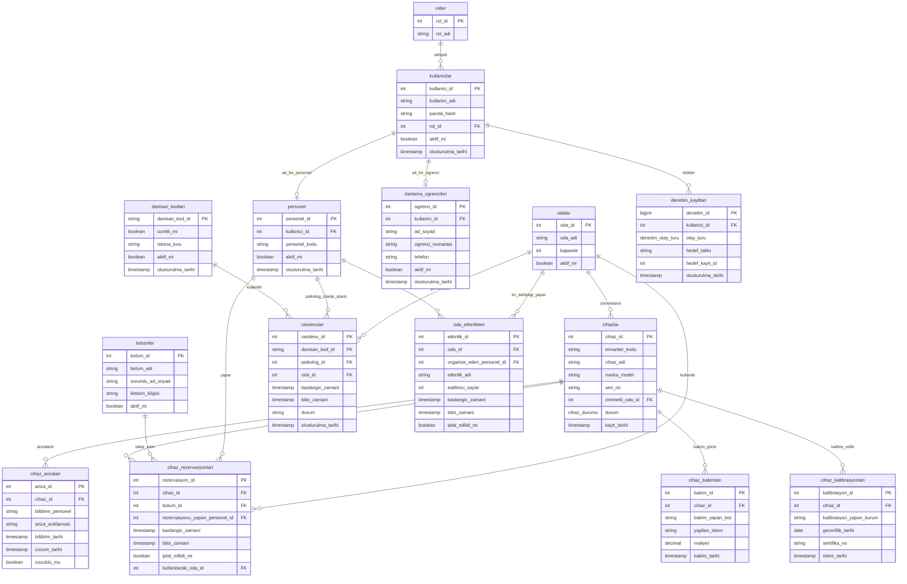

# Cihaz ve Randevu Yönetim Sistemi - Varlık-İlişki (ER) Diyagramı

Veritabanı şifrelerinize ve tablo yapınıza dayanarak hazırlanan Mermaid.js formatındaki ER diyagramı ve modül açıklamaları aşağıdadır.

## Mermaid ER Diyagramı

## Modül Bazlı İlişki Özeti

1. **Kullanıcı ve Yetkilendirme Modülü:** 
   - `roller` tablosu `kullanicilar` tablosuna 1-N ilişkiyle bağlanır.
   - Her kullanıcı `personel` veya `danisma_ogrencileri` tablosu ile birebir (1-1) ilişkilidir.
   - Gerçekleşen işlemler `denetim_kayitlari` tablosuyla takip edilir.

2. **Cihaz Yönetimi Modülü:**
   - `cihazlar` tablosu `odalar` tablosuna (zimmetli oda olarak) bağlıdır.
   - Cihazların; `cihaz_rezervasyonlari`, `cihaz_arizalari`, `cihaz_bakimlari` ve `cihaz_kalibrasyonlari` tabloları ile bire-çok (1-N) ilişkisi bulunur.

3. **Randevu ve Oda Yönetimi Modülü:**
   - `randevular` tablosu; `danisan_kodlari`, `personel` (psikolog) ve `odalar` tablolarına bağlanır.
   - Kurum içi etkinlikler `oda_etkinlikleri` tablosu ile yönetilir ve `odalar` / `personel` tablolarına referans verir.